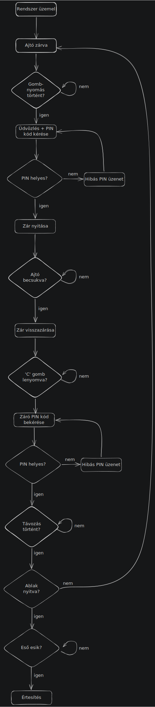
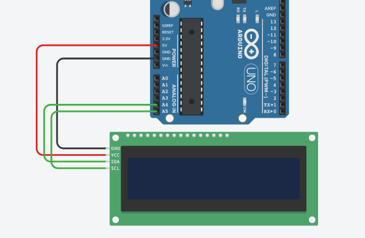
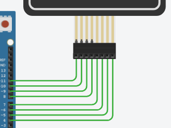
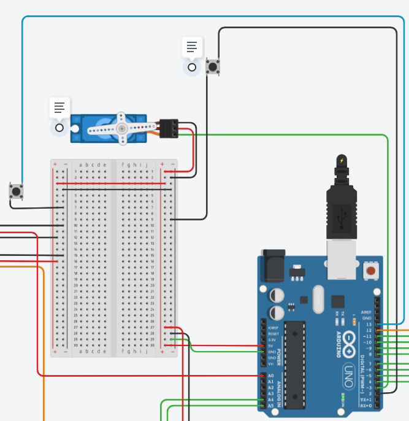
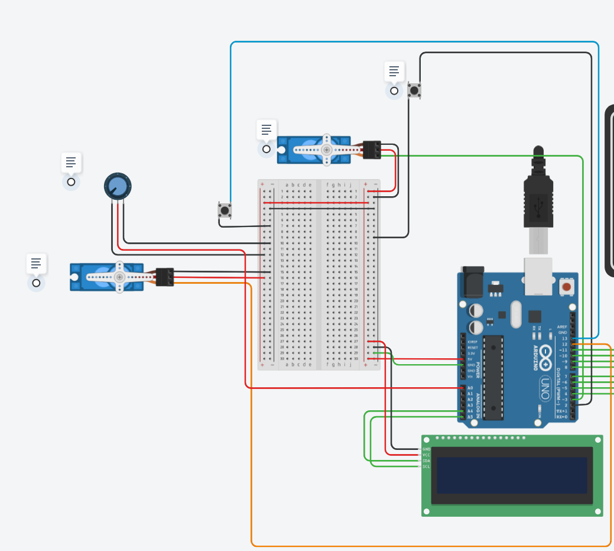

# Okos beléptető

## Projekt leírás:

Ez a projekt a Neumann János Egyetem mérnökinformatikus BSc képzésén, a Digitális Technika II. tárgy beadandójaként készült.

|Hallgató adatai| |
|---|--|
|Hallgató neve:| Slezák Gábor|
|Neptun kód:   | o6kji9|

A projekt célja egy Arduino-alapú okos beléptetőrendszer megvalósítása Tinkercadben.
## Az okos beléptető use-case:

Az okos beléptető célja egy olyan Proof of Concept rendszer kialakítása, amely a szállásadók számára megkönnyíti a vendégek találkozás- és kulcsmentes bejutását az ingatlanba. A rendszer emellett képes jelezni, ha a szálláson nyitva marad egy ablak és esik az eső, ezáltal hozzájárulva az esetleges beázások megelőzéséhez.

### Funkciók és azok megvalósítása:

- A rendszer bekapcsolt állapotban `Üdvözli` a felhasználót. Amint a Keypadon egy gomb megnyomásra kerül prompt jelzi, hogy a rendszer várja a PIN kódot a zár nyitásához.
- A rendszer külön nyitó és záró PIN kódot tárol.
- Hibás PIN esetén hibaüzenet jelenik meg, és visszaadja a korábbi képernyőt.
- Helyes PIN esetén az ajtó nyílik/záródik.
- A zármechanizmust a Micro Servo szimbolizálja, amely a zárt és nyitott állapotot különböző pozíciókkal modellezi.
- Zár nyitását követően a rendszer figyeli, hogy megtörténik-e az ajtó becsukása. Ezt a rendszer egy pushButton komponenssel modellezi Tinkercadban. Képzeljünk el egy gombot, ami az ajtótest ajtókeretbe kerülésével benyomódik, ezzel jelezve a rendszernek az ajtó becsukását.
- Az ajtó bezárásakor a zár magától záródik.
- A rendszernek a távozási szándékunkat a 'C' gomb lenyomásával jelezhetjük, ami ilyenkor kéri a záró PIN kódot.
- Távozás után, amennyiben az ablak nyitva maradt és a rendszer esőt érzékel, a rendszer küld egy push notificationt. Ennek célja lehet pl. egy Google Cloudban CloudRunon futó container alkalmazás, amely értesíti a tulajdonost, miszerint az ablak nyitva van. Tinkercad korlátai miatt ezt egy mock `RAINRAIN` üzenettel helyettesítettem, amely a `Serial Monitor`ban követhető nyomon.
- Az esőérzékelés szimulációja potméterrel lett megvalósítva.

### Folyamatábra



### Állapotgép működése:

A program működése állapotgéppel valósult meg. A program nem sorban fut, hanem mindig van egy aktuális állapot, amiben létezik.

```c++
    enum Screen {
    SCREEN_WELCOME,
    SCREEN_PIN,
    SCREEN_OPENED_DOOR,
    SCREEN_CLOSED_DOOR,
    SCREEN_ERROR,
    SCREEN_LEAVING,
    SCREEN_LEFT
    };
```

Így például belépésre várva:
```
SCREEN_WELCOME → SCREEN_PIN → SCREEN_OPENED_DOOR → SCREEN_CLOSED_DOOR
```
Vagy például távozásnál:
```
SCREEN_OPENED_DOOR → SCREEN_LEAVING → SCREEN_LEFT → SCREEN_CLOSED_DOOR
```
## Tinkercad részletek:

### Fő komponensek:

- Arduino Uno R3
- Keypad 4x4
- LCD 16 x 2 (I2C)
- 2db Micro Servo
- Breadboard Small
- PushButton - Egy az ablak, egy pedig az ajtó szimulálására.
- Potméter - Az esőérzékelés szimulálására.

### LCD kijelzés megvalósítása:


|LCD Pin|Arduino Uno R3 Pin|BreadBoard|
|-----|--------------|----------|
|SCL|A5|
|SDA|A4|
|VCC|- | Power +|
|GND|- | Ground -|

#### LCD működése:

Az LCD kijelző nem folyamatosan frissíti magát, hanem kifejezetten akkor, amikor képernyőváltás vagy valamilyen esemény történt:

```
  if (currScreen != prevScreen) {
    isClearNeeded = true;
    prevScreen = currScreen;
  }
```

Amennyiben `isClearNeeded`, úgy az egyes képernyőváltások esetén megtörténhet a kijelző törlése és frissítése.

### Keypad bekötése:


|Keypad Pin|Arduino Uno R3 Pin|
|-----|--------------|
|Row 1|11|
|Row 2|10|
|Row 3|9|
|Row 4|8|
|Column 1|7|
|Column 2|6|
|Column 3|5|
|Column 4|4|

#### PIN-kezelés megvalósítása Keypaddel:

A rendszer:
- A Keypadról fogad karaktereket.
- Külön nyitó és záró kód került alkalmazásra.
- LCD nem mutatja a beütött számokat, csak * karaktereket.
- Hibás PIN esetén hibaüzenet jelenik meg és visszatér korábbi állapotába.
- Távozáskor, a záráshoz a PIN kód beütése előtt 'C' gombot kell nyomni, innen tudja a rendszer, hogy zárni kívánjuk az ingatlant. Itt a rendszer külön figyel arra, hogy ha nincs zárva az ajtó, akkor nem engedi a PIN kód beütését.

### Ajtózár:

#### Micro Servo és PushButton bekötése:


|Micro Servo|PushButton|BreadBoard|Arduino Uno R3 Pin|
|-----|-----|-----|------|
|Ground||BreadBoard -|
|Power||BreadBoard +|
|Signal|||13|
||Terminal 1a|BreadBoard -| |
||Terminal 2b||2

#### Ajtóvezérlés megvalósítása Micro Servo és PushButton segítségével:

- A Micro Servo jelképezi az ajtót.
- A rendszer alapból zárt ajtóval indul.
- Helyes PIN után nyílik. Ezt követően gombnyomással nyitható, amely egy érzékelőt szimulál, ami az ajtó zárt állapotát jelzi a rendszernek az `isDoorClosed` bool változó segítségével.


### Ablakzár

#### Micro Servo - PushButton bekötése:


|Micro Servo|Potmeter|PushButton|BreadBoard|Arduino Uno R3 Pin|
|-----|-----|-----|------|-----|
|Ground|||BreadBoard -|
|Power|||BreadBoard +|
|Signal||||12|
|||Terminal 1a|BreadBoard -| |
|||Terminal 2b||13|
||Terminal1||BreadBoard +|
||Wiper|||A0|
||Terminal2||BreadBoard -|

#### Ablakvezérlés megvalósítása Micro Servo és PushButton segítségével:

- A Micro Servo jelzképezi az ablak zárját.
- A rendszer alapból nyitott ablakkal indul. Ez tulajdonképpen azt szimbolizálja, hogy belépéskor a rendszer automatikusan kinyitja az ablakot.
- `isWindowOpen` tárolja, hogy az ablak éppen nyitva vagy zárva van.

#### Esőérzékelés

- Az esőérzékelés potméter szimulálja.
- Az esőt 30% felett tekintjük olyan mértékűnek, amire a rendszer `RAINRAIN` figyelmeztetéssel reagál, amely a `Serial Monitor`ban látható. Ez szimbolizálja a kiküldésre kerülő értesítést egy felhőben futó applikáció számára (Pl. CloudRunban futó endpoint, ami képes értesíteni az ingatlan tulajdonosát).

```c++
int percentage = map(value, 0, 1023, 100, 0);
```
A map() az analóg értéket százalékos értékké alakítja és ezt használja a rendszer az eső mértékének megállapításához.

## Tesztesetek:

A rendszer jelenleg - a TinkcerCAD korlátaira tekintettel is - manuálisan tesztelhető.

Tesztesetek:
| Teszteset | Elvárt rendszerműködés |
|---|---|
|Helyes nyitó PIN|Az ajtó nyílik.|
|Helytelen PIN|Hibaüzenet és visszaadja az előző képernyőt.|
|Ajtó nyitás PIN beadása után | Nyitott rendszer esetén az ajtó nyitható és zárható az ajtó gombbal. |
|Távozás C gombbal | A rendszer csak akkor ajánlja fel a záráshoz szükséges PIN kód beütését, ha az ajtó zárva van.|
|Ablak nyitás/zárás| Megvalósítható bezárt rendszer esetén is, vélelmezve, hogy valaki távozása esetén is az otthonmaradottak részére lehetőséget kell biztosítani az ablak nyitására, zárására. Ez azt is jelenti, hogy aki bent van az ingatlanban, annak is szükséges PIN a kijutáshoz. Ez azzal lenne megoldható, hogy bent és kint is van keypad és LCD.|
|Esőjelzés nyitott ablak esetén | Nyitott ablak esetén 30% feletti eső esetén a rendszer jelzést ad.|
|Esőjelzés zárt ablak esetén | A rendszer nem ad jelzést, függetlenül az eső mennyiségétől.|
 
## Továbbfejlesztési lehetőségek:

- delay() helyett lehetne millis() alapú időzítés.
- Valós fizikai eszközzel, internetre csatlakozva megoldható lenne a távoli PIN kód módosítás.
- Eső esetén az ablak automatikusan bezárhatna, de mozgásérzékelővel, hogy pl. a macskát ne lökjük ki az ablak zárásakor.
- Hang- és LED visszajelzések beépíthetőek lennének.